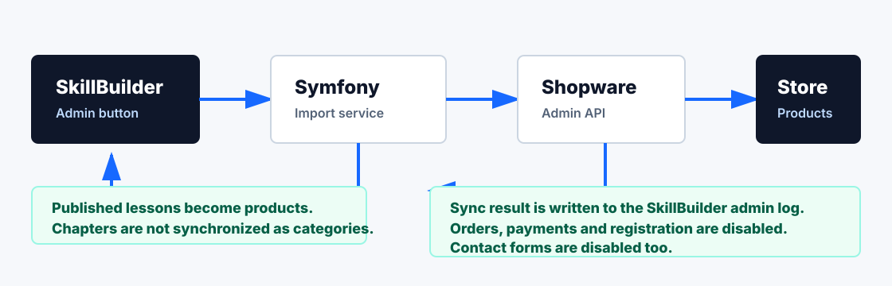
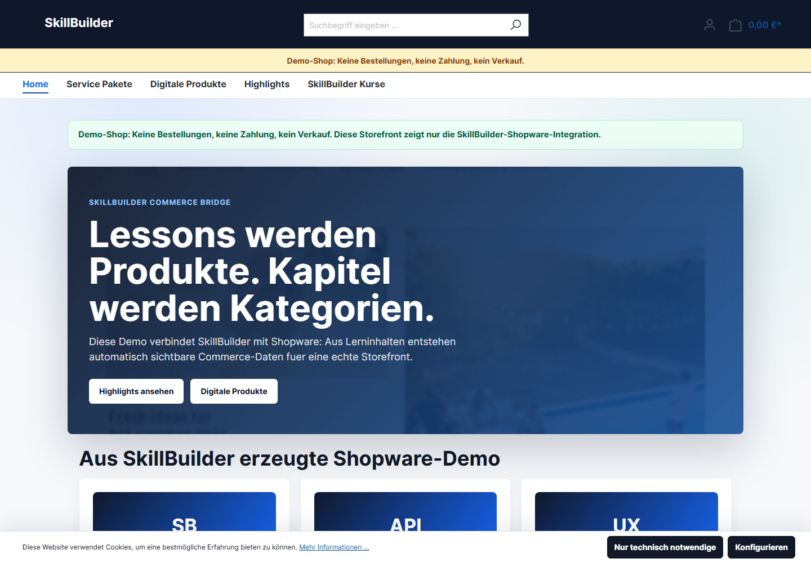
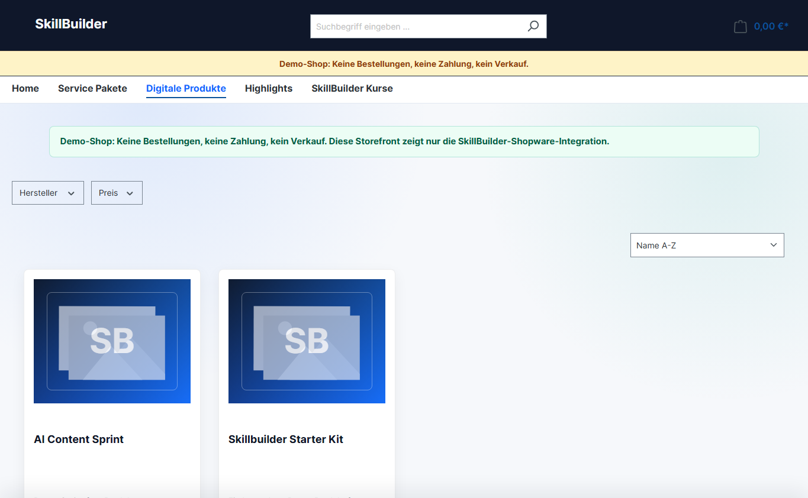
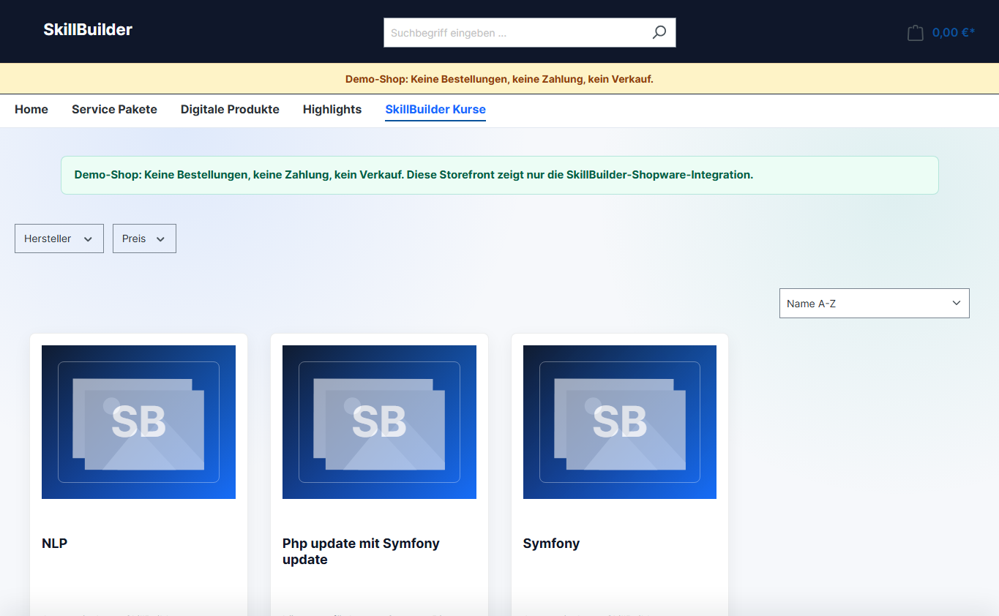
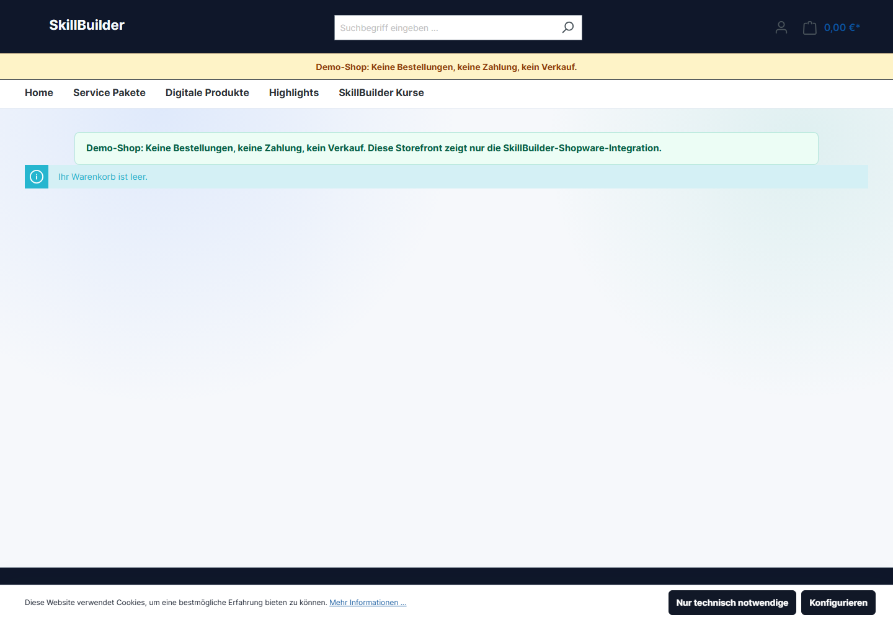

# SkillBuilder Shopware Admin API Integration

**Live Demo (Portfolio): [https://sw.mcmonaco.de](https://sw.mcmonaco.de)**

Connected SkillBuilder portfolio repository: [roadynet/skillbuilder-showcase](https://github.com/roadynet/skillbuilder-showcase)

**Recruiter summary:** real Shopware Admin API integration for SkillBuilder. Published SkillBuilder lessons are synchronized as Shopware products through an admin button in the Symfony application. The storefront shows the result as a demo shop with orders, payment, registration, and contact forms disabled.

## What I Built

- Admin-triggered product synchronization from SkillBuilder into Shopware
- Shopware Admin API import workflow for published SkillBuilder lessons
- stable product numbers with update instead of duplicate creation
- activation/deactivation based on SkillBuilder publication status
- storefront demo aligned visually with the SkillBuilder dashboard
- no-sale demo protection: no checkout, no payment, no registration, no contact form

## Quick Facts

| Bereich | Inhalt |
| --- | --- |
| Projekt | Funktionsfaehige Shopware-Integration fuer SkillBuilder |
| Live-Demo | [https://sw.mcmonaco.de](https://sw.mcmonaco.de) |
| Echt umgesetzt | SkillBuilder Admin-Button synchronisiert veroeffentlichte Lessons ueber die Shopware Admin API als Produkte |
| Mapping | Lessons werden Produkte. Kapitel werden nicht als Kategorien synchronisiert. |
| Sichtbarkeit | Nur `published` Lessons erscheinen im Shop; nicht mehr veroeffentlichte Produkte werden deaktiviert |
| Mein Anteil | Shopware Admin API Integration, Symfony Import-Service, Statuslogik, Storefront-Demo, Demo-Schutz |
| Demo-Schutz | Keine echten Bestellungen, keine Zahlung, keine Registrierung, kein Kontaktformular, keine personenbezogenen Daten |

**Kurz gesagt:** SkillBuilder pflegt veroeffentlichte Kurse per Admin-Button direkt als Produkte in einen echten Shopware-Shop ein. Die Storefront zeigt das Ergebnis, ohne Kundendaten oder Bestellungen zu verarbeiten.

**Positioning:** PHP/Symfony backend integration, Shopware 6 concepts, Admin API automation, product synchronization, and demo storefront operation.

## Architecture



The important path is:

`SkillBuilder Admin -> Symfony Import Service -> Shopware Admin API -> Shopware Products -> Storefront`

Wichtig: Lessons werden Produkte. Kapitel werden in dieser Demo nicht als Kategorien synchronisiert. Die Produkte werden gesammelt der Shop-Kategorie `SkillBuilder Kurse` zugeordnet.

## Screenshots

### Storefront



### Produktliste



### SkillBuilder-Kurse in Shopware



### Demo-Warenkorb ohne Verkauf



## Features

- reale Shopware Admin API Synchronisation
- SkillBuilder-Import: veroeffentlichte Kurse werden als Shopware-Produkte erzeugt
- Statussteuerung ueber `published`
- automatische Aktivierung und Deaktivierung von Produkten
- veraltete Unterkategorien aus frueheren Demo-Importen werden ausgeblendet
- Kapitel werden nicht als Kategorien angelegt oder synchronisiert
- Admin-Workflow per Button
- Environment-basierte API-Konfiguration
- Produktkatalog
- Suche und Filter
- Warenkorb-Ansicht
- Checkout-nahe Demo ohne echte Zahlung
- sichtbarer Demo-Hinweis: keine Bestellung, keine Zahlung, kein Verkauf
- deaktivierte Registrierung, Login-Formulare und Kontaktformulare fuer eine DSGVO-sichere Portfolio-Demo

## Tech Stack

- PHP / Symfony im SkillBuilder Backend
- Shopware 6
- Shopware Admin API
- API-basierter Produktimport
- JavaScript
- HTML / CSS
- Git / GitHub

## API-basierte Produktsynchronisation

In SkillBuilder gibt es im Admin-Bereich den Button **Shopware Demo-Produkte**. Dieser Button stoesst den Import in Shopware an:

1. SkillBuilder liest alle Lessons mit Status `published`.
2. Fuer jede veroeffentlichte Lesson wird ein Shopware-Produkt mit der Produktnummer `SB-COURSE-{id}` erzeugt oder aktualisiert.
3. Die Produkte werden der Shop-Kategorie `SkillBuilder Kurse` zugeordnet.
4. Produkte, die nicht mehr zu veroeffentlichten Lessons gehoeren, werden in Shopware deaktiviert.
5. Alte Demo-Unterkategorien werden ausgeblendet, damit keine frueheren Importversuche in der Navigation sichtbar bleiben.

Die Zugangsdaten zur Shopware Admin API liegen nicht in diesem Repository. Sie werden in der produktiven Umgebung ueber Environment-Variablen gesetzt.

Diese Integration laeuft gegen eine echte Shopware-Installation. Der oeffentliche Code-Auszug ist bereinigt, damit keine produktiven Zugangsdaten oder Serverdetails veroeffentlicht werden.

### Code-Auszug

Der relevante Import-Code ist als bereinigtes Beispiel im Repository enthalten:

- [Symfony Admin Controller](examples/skillbuilder-shopware-import/AdminShopwareDemoProductController.php)
- [Shopware Admin API Import Service](examples/skillbuilder-shopware-import/ShopwareDemoProductImporter.php)
- [Recruiter project summary](docs/project-summary-for-recruiters.md)
- [Interview Q&A](docs/interview-qa.md)
- [Portfolio audit report](docs/audit-report-2026-05-23.md)

Das Beispiel zeigt die eigentliche Bridge-Logik ohne produktive Zugangsdaten.

## Business-Nutzen

Dieses Projekt zeigt einen realen Workflow fuer Anbieter digitaler Inhalte:

- Kursinhalte muessen nicht doppelt in Lernplattform und Shop gepflegt werden.
- Nur freigegebene Inhalte erscheinen automatisch im Shop.
- Der Shop wird zur sichtbaren Commerce-Oberflaeche fuer SkillBuilder-Inhalte.
- Admins koennen Shopware-Produkte per Button synchronisieren.
- Die Integration verbindet Lernplattform, E-Commerce und Content-Automation.
- Produktpflege wird von manueller Shop-Administration zu einem wiederholbaren Datenprozess.

## Warum dieses Projekt existiert

Das Projekt erweitert SkillBuilder um eine praxisorientierte E-Commerce-Integration. Es zeigt nicht nur ein Frontend, sondern eine konkrete Verbindung zwischen Lernplattform, Shopware Admin API und Storefront.

Der Shop ist bewusst als Demo markiert. Es werden keine echten Kundendaten, Zahlungen oder produktiven Zugangsdaten verarbeitet.

## Lokal starten

```bash
npm run dev
```

Danach ist die lokale Demo standardmaessig unter `http://127.0.0.1:5173` erreichbar.

Alternativ kann `index.html` direkt im Browser geoeffnet werden.

## Naechste Schritte

- Sync-Log um eine Detailansicht pro Produkt erweitern
- Produktbilder und Preise aus SkillBuilder-Metadaten ableiten
- Shopware-Produktdetailseite weiter an SkillBuilder-Metadaten anreichern
- weitere Screenshots oder kurzes Demo-Video ergaenzen
